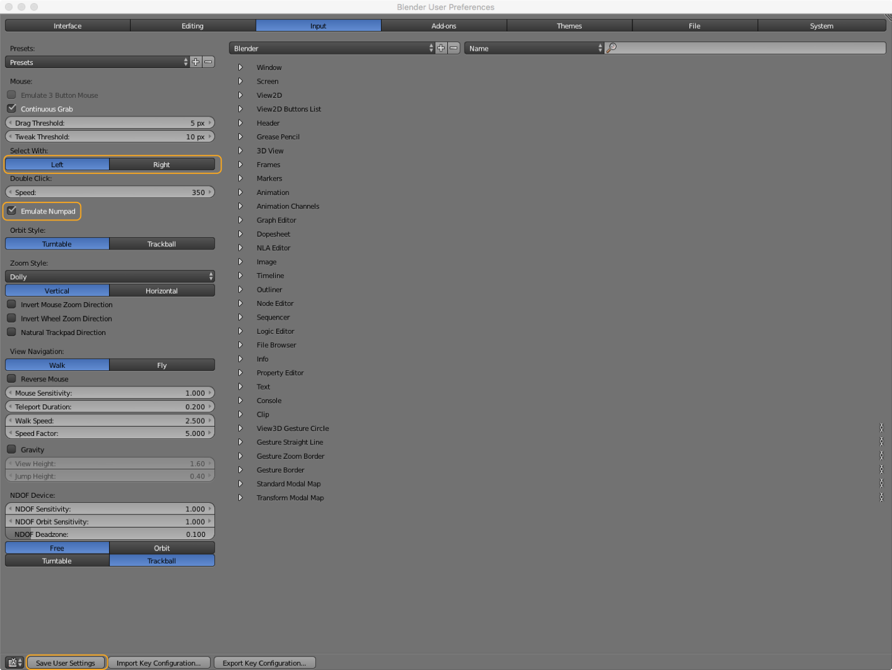

### Shortcuts  
Blender relies heavily on shortcuts. See all shortcuts here [waldobronchart.github.io/ShortcutMapper/#Blender](http://waldobronchart.github.io/ShortcutMapper/#Blender). Some shortcuts depend on the position of the mouse e.g. __x__ for deleting only works when the mouse is over the 3D viewport.  

#### Customize UI

Go to: File > User Preferences… and select the "Input" tab.  

- Change the Mouse selection from right click to left click in the settings > input tab
- emulate Numpad (if you're on a laptop you can use the numbers instead of the numpad)
- adjust UI colors in the theme tab (if you like it more fancy)  

You need to hit "Save User Settings" at the bottom of the window to apply these changes. 

  

You can add or remove windows by right clicking into the "seam" between two windows to add or join new windows. When adding you toggle horizontal or vertical split by pressing the middle mouse button. You can do the same by clicking and dragging the upper left corner to the left or down. To remove them just join them again. (See the animation below)  

| Mouse                                               | Action                           |
| :---                                                | :---                             |
| Right click window seam                             | split/join windows               |
| Right click window seam select split + middle mouse | toggle horizontal/vertical split |
| click + drag striped corner down/up                 | split horizontally               |
| click + drag striped corner left/right              | split vertically                 |

You can change the content of a window by changing the icon in the tool bar.  

  

In the 3D View you also have a toolbar on the left and the tool shelf on the right. __t__ shows tool bar and __n__ the tool shelf.

### Navigation  

The basic navigation in the 3D viewport is done with the mouse. You can also change the view by using the numpad.  

| Mouse                       | Action                 |
| --------------------------: | ----------             |
| left mouse                  | select                 |
| right mouse                 | set 3D cursor position |
| middle mouse click          | orbit                  |
| middle mouse click + shift  | pan                    |
| scroll                      | zoom                   |

_The most useful keys on the numpad are (table also has emulated numpad):_  

| Key Combo (emulated) | View Change                                | Key Combo       |
| ----------:          | :----- ----------------------------------- | :----------     |
| 1                    | Front                                      | Numpad 1        |
| Ctrl + 1             | Back                                       | Numpad Ctrl + 1 |
| 3                    | Right                                      | Numpad 3        |
| Ctrl + 3             | Left                                       | Numpad Ctrl + 3 |
| 7                    | Top                                        | Numpad 7        |
| Ctrl + 7             | Bottom                                     | Numpad Ctrl + 7 |
| 5                    | Toggle orthographic vs perspective mode    | Numpad 5        |
| 0                    | Camera View                                | Numpad 0        |
|                      | **Not so important keys**                  | Numpad          |
| 4                    | Orbit Left                                 | Numpad 4        |
| Ctrl + 4             | Pan Left                                   | Numpad Ctrl + 4 |
| 6                    | Orbit Right                                | Numpad 6        |
| Ctrl + 6             | Pan Right                                  | Numpad Ctrl + 6 |
| 8                    | Orbit Up                                   | Numpad 8        |
| Ctrl + 8             | Pan Up                                     | Numpad Ctrl + 8 |
| 2                    | Oribit Down                                | Numpad 2        |
| Ctrl + 2             | Pan Down                                   | Numpad Ctrl + 2 |
| -                    | Zoom Out                                   | Numpad -        |
|                      | Zoom In (seems not to work)                |                 |

### Object and Edit Mode  

The "Object Mode" is for working with objects in a whole. The "Edit Mode" is for editing vertices, edges or faces of an object. When using [modifiers](#modifiers) you see their effect in object mode. Not in Edit Mode.

### Selection 

To select objects use the left mouse click (if set to left selection. The default is right selection). You can add or remove objects to or from the selection by holding shift. Selected objects are highlighted in orange (default theme). The first in the order of selected objects is a bit brighter. You can also select everything by hitting __a__. In "Edit Mode" there are some extra options for selecting things. You can switch between vertices, edges and faces selection and you can combine them with the buttons on the bar below the 3D viewport. 

  

The rectangular (hit r before selecting) or circular (hit c) selection by clicking and dragging only applies to the visible objects, vertices, edges and faces by default you can change this if you want. There are more options for selecting. Like Inverting selections and so on. See [the Blender Manual](https://www.blender.org/manual/modeling/meshes/selecting/introduction.html#selection-mode)  

| Action                       | Result                               | Mode             |
| :---                         | :---                                 | :---             |
| Left Mouse                   | select                               | Object/Edit Mode |
| Left Mouse + Shift           | add/remove                           | Object/Edit Mode |
| a                            | select all                           | Object/Edit Mode |
| Ctrl + i                     | invert the current selection         | Object/Edit Mode |
| Ctrl + Tab                   | selection mode switcher              | Edit Mode        |
| b + left mouse click & drag  | select rectangular area              | Edit Mode        |
| c + left mouse click & drag  | paint selection area                 | Edit Mode        |
| c + left mouse + mouse wheel | paint selection increase or decrease | Edit Mode        |

  

### Transformation  

You can transform objects, groups, vertices, edges and faces (i.e. your selection) by using the 3D manipulators on the bottom of the 3D view. You can combine them or shut them off totally.  

  

Or by using the hotkeys. When using the hotkeys you can easily constrain the manipulation to the axis. Just hit for example g + x to only move the selection on the global x axis. If you hit x twice you transform on the objects local axis. The second transformation corresponds with the pulldown next to the manipulator buttons on the button of the viewport. Read some more about the manipulators [here](https://www.blender.org/manual/editors/3dview/transform/transform_control/manipulators.html).   

| Key            | manipulation                                                  |
| :---           | :---                                                          |
| r              | rotate                                                        |
| r + x/y/z      | rotate on one axis only (global)                              |
| r + x/y/z × 2  | rotate on one axis only (selected axis)                       |
| g              | transform (grab)                                              |
| g + x/y/z      | transform (grab) on one axis only (global)                    |
| g + x/y/z × 2  | transform (grab) on one axis only (selected axis)             |
| s              | scale                                                         |
| s  + x/y/z     | scale on one axis only (global)                               |
| s  + x/y/z × 2 | scale on one axis only  (selected axis)                       |
| alt + g        | snaps selection to the center of the scene (Object Mode only) |

### 3D Cursor 

shift c reset cursor  

Shift + C = center cursor

### creation  

#### duplication

select Shift + d duplicates and puts it into grab mode

#### add

Use Create tab (left) to add basic objects  
or use shift a 

on creation you get in the tool bar the operator panel. If it is not there hit F6 to show it as a floating panel

all objects get created at the 3D cursor. To have it at the center of the scene use "." You can also adjust the cursor on the Viewport Toolbar

#### modifier

#### delete  

x and confirm

### mesh manipulation

Go to Edit Mode by hitting TAB
Select vertx by hitting left mouse to sleect multiple hold shift. You can chagne between vertex face and edge selection mode

F Fill
I Inset
B Bevel (Moving the mouse changes the depth)

Ctrl f edit faces
Ctrl v edit vertices
    e.g. vertex slide
Ctrl e edit edge
    e.g. edge slide

edge or vertex selected + gg goes into edge slide and vertex slide mode  

### Modifiers
- subdevision surface
- boolean

-----
create unfolded data

1. 123DMake (cross platform)
2. Paperkura (Win 38$)
3. dxf2papercraft commandline tool (open source Win & Linux)  
4. Processing

### Workflow 1. 123DMake  

3D application (modeling) > Export Wavefront (obj) or Binary/ASCII STL (stl) > 123DMake > Export PDF or EPS > 2D application (clean up) > Export DXF R14 (Illustrator/Inkscape)  

### Workflow 2. Paperkura  

3D application (modeling) > Export Metasequoia (mqo), Wavefront (obj), AutoCAD 3D (dxf), 3DS Max (3ds), Lightwave (lwo), Binary/ASCII STL (stl), Google Earth4 (kml, kmz), Collada (dae) > Paperkura > Export PDF/EPS > 2D application (clean up) > Export DXF R14 (Illustrator/Inkscape)  

[www.tamasoft.co.jp/pepakura-en](http://www.tamasoft.co.jp/pepakura-en/productinfo/index.html)
### Workflow 3. dxf2papercraft  

3D application (modeling) >  AutoCAD 3D (dxf) > dxf2papercraft > Export 2D DXF > OpenOffice/Libre Office > Export PDF > 2D application (clean up) > Export DXF R14 (Illustrator/Inkscape)  

- [dxf2papercraft.sourceforge.net](http://dxf2papercraft.sourceforge.net/)  

### Workflow 4. Processing  

Processing > Export OBJ > 3D Application (clean up) > Export Wavefront (obj) or Binary/ASCII STL (stl) > WF 1, 2, 3

---

### Misc Links  

##### References

- [www.blender.org/manual](https://www.blender.org/manual/)

##### Tutorials

__Blender__  

- [Blender Basics - 00 - Introduction](https://www.youtube.com/watch?v=zOvawDOWqC4) and following …

#####Other experimental papercraft tools  

- [https://trmm.net/Unfolding_STL](https://trmm.net/Unfolding_STL)