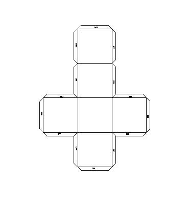

Using vagrant to use the [dxf2papercraft](http://dxf2papercraft.sourceforge.net/) tool.  

run (assuming vagrant is installed):  

```shell
vagrant up
vagrant ssh
cd shared-folder
tar xfz dxf2papercraft_v0.2.tgz
dxf2papercraft_v0.2/dxf2papercraft_64bit cube.blend.dxf out.dxf
```
you now have a out.dxf file that you can open with Libre Office and export as a pdf for further cleaning.  

  
