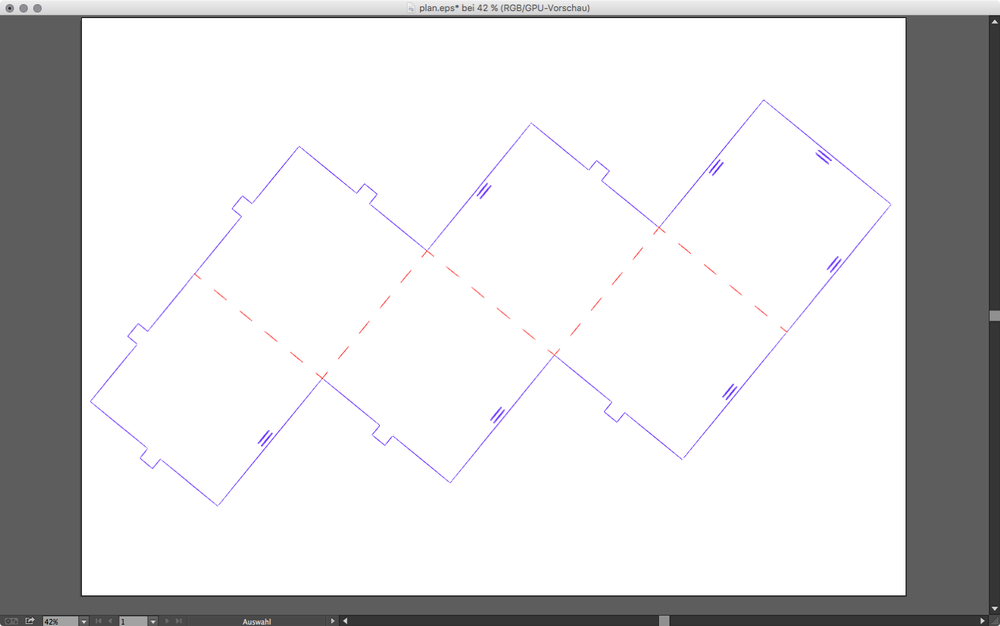
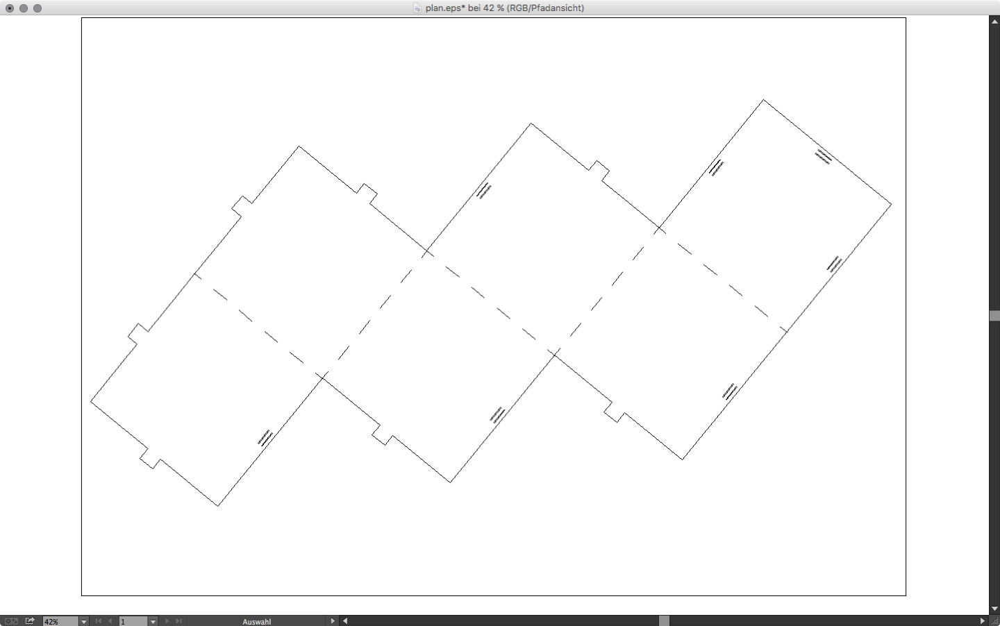
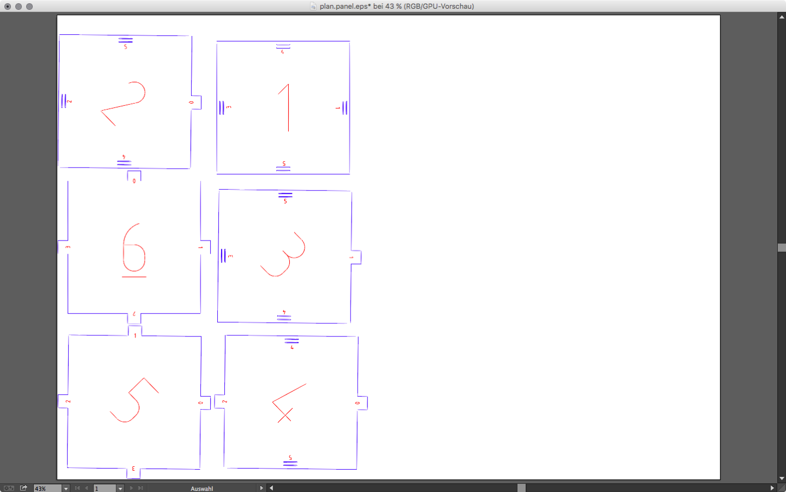
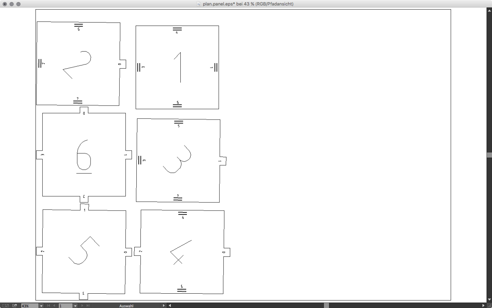
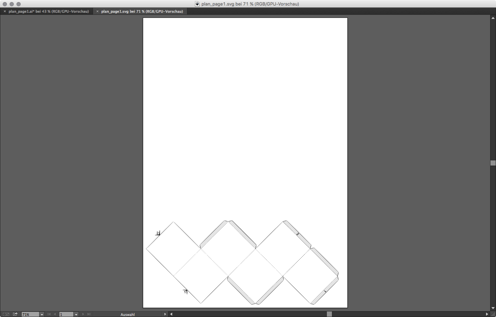
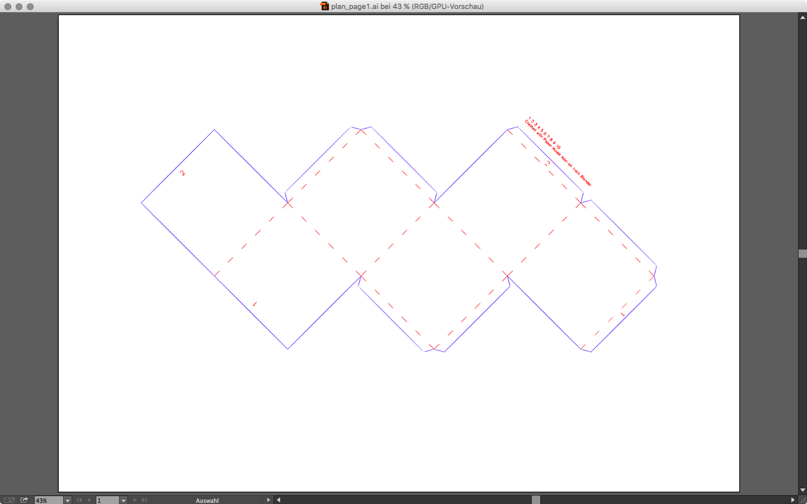
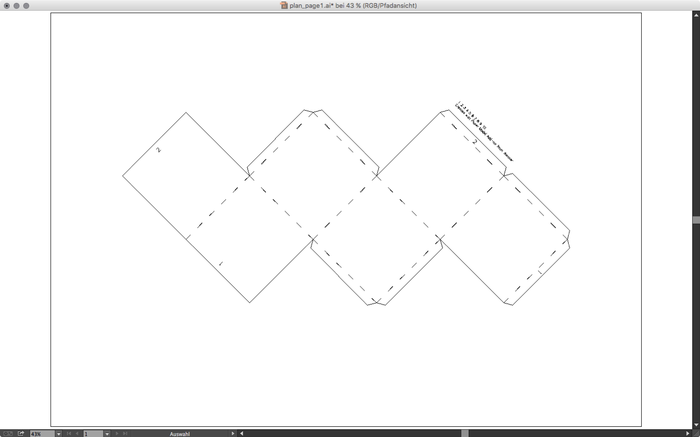
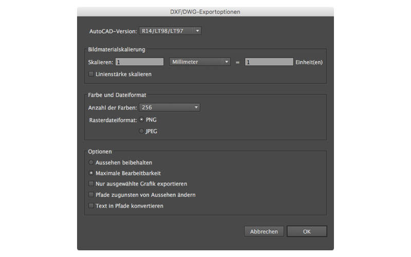
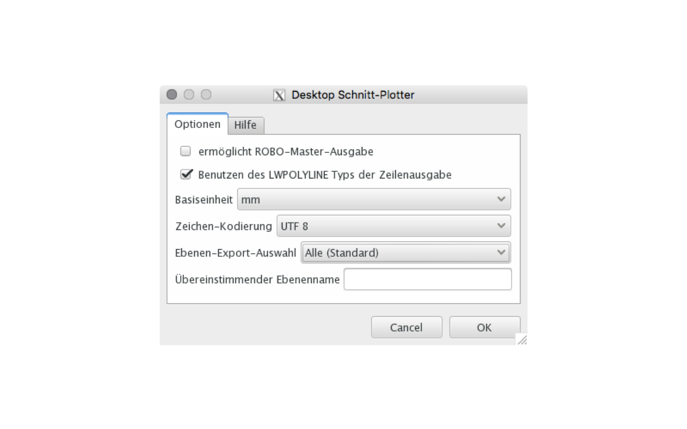

After modeling our object in Blender and exporting it with the [Paper Model Add-on](paper-model-add-on) we have a .svg file. If we did the additional step with Slicer we have a .eps file. Both can be edited in vector editors. For the best result we need to clean up the data a bit more. We will use Adobe Illustrator (Mac, Win) for this.  

!!!hint
    If you don't have a license for Illustrator you can also use Inkscape (Cross Platform) or Affinity Designer (Mac).  

#### Using Adobe Illustrator  

Open your svg or eps, set the units of the document to millimeters (⌘ + ⇧ + p) and set your artboard size to match the size of your material (can be accessed through the Artboard tool or directly from the document settings). To see what the laser will use you should take a look at the "Path View". You can switch back and forth between the visual view and the path view by hitting ⌘ + y on your keyboard. 

!!!hint  
    - __Using the path view is often much simpler.__ This is what the Sabeko laser software sees.   
    - __One color per "laser cut layer".__ Different colors produce separated layers in the Sabeko laser software.  
    - You can __select objects by color__ using the selection menu.  
    - __Create additional marks for folding and assembly.__ For additional information on your cut plan you can use the [Monoline Text Drawing Script.](https://forums.adobe.com/message/4907404)  
    - __Dashed lines are not really dashed.__ To create real dashed single line paths use [this trick](https://forums.adobe.com/message/3657306) from the Adobe forums.  

##### Plans from Slicer  

If you used Slicer you have the some numbers on the plan and, if not splitted into panels, also some folding marks. We can engrave those with low power setting to have some visual hints where to fold our model. To do so you need to give them a different color then the outer form which should be cutted. The laser cutter application will detect colors and allow us to apply quickly different settings. Release all groups and compound paths if needed. Sort them by color. Remove all unwanted information.  
One important step is to remove the most outer path (it is a rectangle). This is an outer bound created when exporting the .eps file. If we don't do this it will be cutted by the laser. Your final plans should look like the pictures below.  

  
_Plan from 123DMake in normal view, separated by color_

  
_Plan from Slicer in path view_

  
_Split Plan from Slicer in normal view, separated by color_

  
_Split Plan from Slicer in path view_

##### Plans from the Blender Paper Model Add-on  

The size settings from the Paper Model Add-on within Blender are not that intuitive. It is easier export it to something like a A3 paper size and then rescale the model to fit your needs. On the image below you see once the export from blender (the .svg) and on the second and third image the cleaned version in normal and path view. You will need to convert the dotted lines to real paths or it will be a straight cut. Remove all unwanted paths and split them with colors so the laser software can detect them as own layers.  

  
_Plan from the Paper Model Add-on in normal view, unedited_

  
_Plan from the Paper Model Add-on in normal view, separated by color_

  
_Plan from the Paper Model Add-on in path view_

!!!hint
    Using Inkscape  
    The same principles as in Illustrator apply to Inkscape.  

    - Set the size and units of your document.  
    - Rescale your plan to fit your material.  
    - Remove all unwanted paths.  
    - Separate the paths using colors (if needed).  
    - Take a look at the outline view to see the raw paths.  

### Export DXF  

When exporting to .dxf files just you need to watch out for the unit conversion and the DXF version number.  
The laser at the University of Applied Sciences Potsdam (Germany) needs DXF R14 files and the unit scaling should be from one millimeter to one unit. If you already did set your units in the document settings you should be fine. Below you see the export panel from Illustrator and from Inkscape. _Apologize for the localized screenshots._  

  
_Export Panel Adobe Illustrator_

  
_Export Panel Inkscape_
