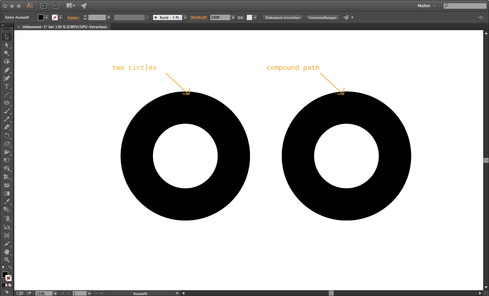

##### (Modeling) Import SVG and extrude

For some of you creating complex shapes in Blender might be awkward at first. To create more complex base forms you can also prepare a vector form in Illustrator or Inkscape, export it as a .svg (Scalable Vector Graphic) file, import and and extrude it.  
To do so prepare your shape in the vector editor of choice and export it as svg. In the image you see on the left two circles where the smaller one is white and the other bigger one is black and on the right hand side a compound path.  

!!!note
    To have a single mesh in Blender you need to combine paths into compound paths.  

  

When your shape is ready save it as a .svg (Version 1.1) file and switch to Blender. Go to "File > Import > Scalable Vector Graphic (svg)" and select your file and hit import. You will first see nothing. The imported curves are so small that it seems like nothing was imported. In the outliner on the upper right corner you will see that some curves where added to your scene. Click once on one of them. If you have nothing else in your scene hit "a" to select everything and then "n" to open the tool shelf on the right side of the viewport. There you can scale them up by giving them a higher scale. In our case it is a value of 2000 units but this might be different in your case. The cente of the object you've imported is now a bit of. To fix that hit ⇧ + ^ + ⌥ + C and select the Geometry to origin option.  
Now go to the properties window and select the "curve" panel. There you have a Geometry section where you can extrude your curve.  