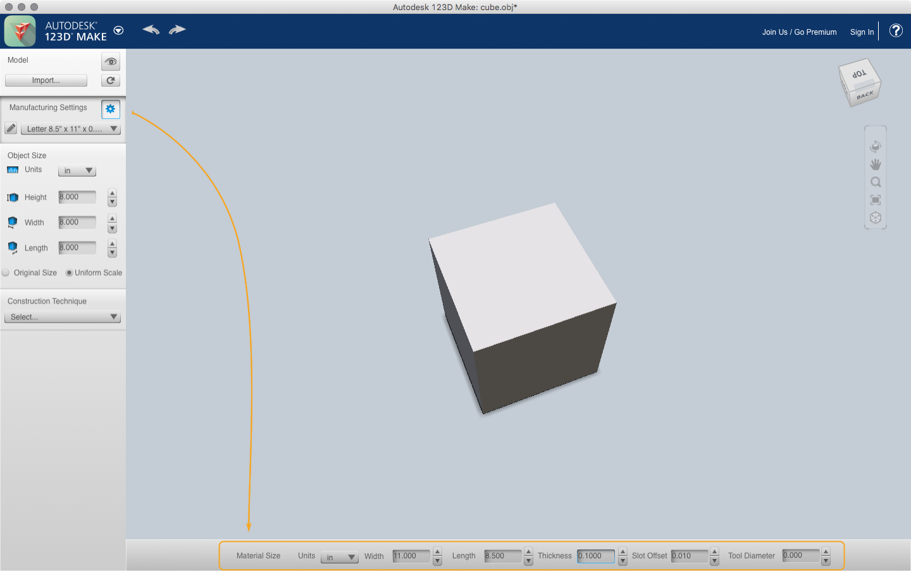
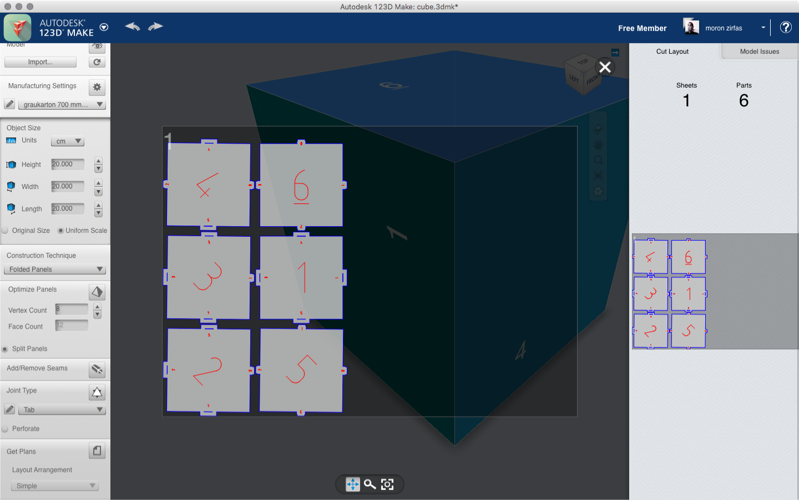
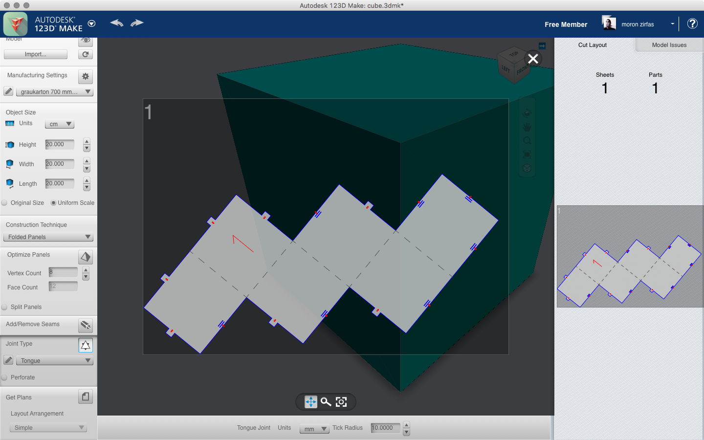
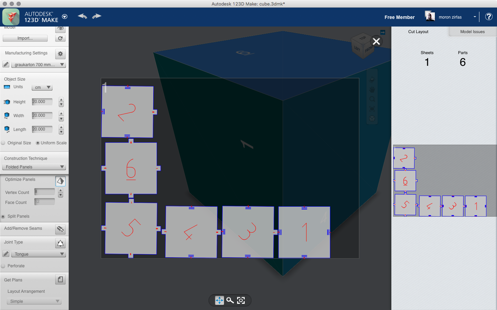
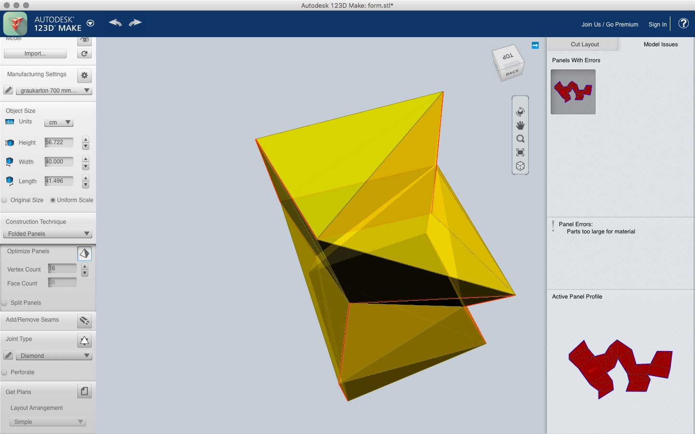

## About Slicer for Fusion 360

When you are done with creating a simple 3D object either by using [Blender](/blender/) or with [Processing](/processing/) you can move on to [Autodesks Slicer for Fusion 360](https://apps.autodesk.com/FUSION/en/Detail/Index?id=8699194120463301363&os=Win64&appLang=en) . This applicaiton allows creation of low-tech LOM-style (Laminated object manufacturing) solid models. The application has several construction techniques for now we will only focus on creating [Folded Panels](#folded-panels).  

!!!hint
    - __The default unit is inch__. This cannot be set globally you will need to adjust this for each panel where you use units.
    - On a German localized computer __the application accepts as decimal point the comma when entering values by typing __- even though the numbers are displayed with a dot  
    - __Pasting into fields wont work__. Use the Right Mouse Button and paste from the pop up menu.  
    - __Splitting the panels can save you a lot of material__.  
    - On Mac OSX you can __extract the Help PDF by opening the application package__. In there you'll find the PDF under /Applications/SlicerForFusion360.app/Contents/
        Resources/LargeFormatSlicerHelp.pdf
    - __You need an Autodesk account__ for exporting your plans.
    - __Don't perforate your plan__. The marks for the folding lines are enough to. We will cut them with different settings leaving a visual mark where to fold your material.  

<!-- !!!warning
    __The application tends to crash.__ Save your work often!   -->

#### Object and Material Settings  

When you import your 3D model you first need to set some options. The manufacturing settings allow you to set the size of your material. This can be set to a fairly huge size (the laser cutter at the University of Applied Sciences Potsdam (Germany) has a size of 1200 mm to 900 mm). You can set the "Object Size" when you need a defined size. Another way is adjusting the size based on your material size. if your desired object size exceeds you material size the application will allow you to export several cut sheets.  
What's more important is to set the "Thickness" of your material. This will determine how narrow/wide the holes for tongues and tabs are we are going to produce later on. There is also another setting we need to take in account. The "Slot Offset". This is the amount of material the laser will take away. For cutting grey cardboard around 0.5 to 1.5 mm you can set this to <=1 mm. You can set all of these settings by pressing the little wrench and then adjusting them on the bottom of the application window. You also can save some presets for your material.   

  

When you done with setting up your material choose from the Construction Techniques "Folded Panels".  

### Folded Panels   

> Separates your 3D model into 2D segments of triangular meshes. These segments (panels) are folded multiple times, then attached using one of ten different joint types. Use paper, cardboard, even sheet metal.  
> - From Slicer Help (within Application)  

##### (Folded Panels) Optimize Panels/Add Remove Seams

If you still want to edit your model you can adjust the count of vertices in these panels or add new seams to your object. You can also split all panels for the final cut plan.  

#### (Folded Panels) Joint Types  

Here you can select how you want to connect your unfolded object after production. Same are useful for paper, others can be used for sewing or lacing. We are going to focus on the tab and tongue types.  

| Joint Types | Description (taken from Slicer Help)                                                                                                                                                                                                                                                                                                 |
| :---        | :---                                                                                                                                                                                                                                                                                                                                   |
| Diamond     | Connect panels by folding and affixing (gluing or welding) the triangular ticks. Change Tick Radius to set the width of the ticks.                                                                                                                                                                                                     |
| Gear        | Connect panels by folding and affixing (gluing or welding) the rectangular ticks. The dark areas of the image need to be cut out. Change Tooth Radius to set the distance from the edge of the sheet for the cutouts. Change Tick Spacing  to set the spacing between the cutouts. Change Tooth Scale  to set the height of the teeth. |
| Laced       | Connect joints by lacing sheets together. Change Hole Radius to make the holes bigger. Change Joint Space to set the spacing between rivets used to connect the joints. Change Tick Radius to set the distance of the rivet holes from the edge of the sheet.                                                                          |
| Multitab    | Connect joint by fixing ticks together. Change Tick Radius to change the height of the ticks. Change Tab Fraction to change the width of the ticks (tabs).                                                                                                                                                                             |
| Puzzle      | Connect joint by fitting pieces together. Change Tick Radius to change the height of the ticks.                                                                                                                                                                                                                                        |
| Rivet       | Connect joint by riveting ticks to one another. Change Hole Radius to make the holes bigger. Change Joint Space to increase or decrease the number of rivets used to connect the joints. Change Tick Radius to set the distance of the rivet holes from the edge of the sheet.                                                         |
| Seam        | Connect joints by sewing them together (like a sewing pattern). Change the Seam Radius to change the width of the seam’s panel border.                                                                                                                                                                                                 |
| Tab         | Connect joints by inserting a tick into slots. Change the Tick Radius to change the width and length of the slots and ticks.                                                                                                                                                                                                           |
| Ticked      | Connect joints by connecting the ticks along the seams Change Tick Space to make the ticks closer to one another or further apart. Change the Seam Radius to change the width of the seam’s panel border.                                                                                                                              |
| Tongue      | Connect joint by inserting a tick into slots. Change Tick Radius to change the tick length and width and slot width.                                                                                                                                                                                                                   |

##### (Folded Panels) Joint Type Tab  

On the first image below you see the plan for a cube laid out with the "Tab" joint type. The size of the cube is 20 mm × 20 mm × 20 mm on a sheet with the size of 700 mm × 1000 mm × 0.5 mm. The "Tab Joints" are set to have a "Tick Radius" of 10 mm (set it at the bottom of the window). The second one has the same settings but with "Split Panels" enabled.  

  

  

##### (Folded Panels) Joint Type Tongue

The "Tongue" type is similar to the tab type. We used here the same settings. 
 The size of the cube is 20 mm × 20 mm × 20 mm on a sheet with the size of 700 mm × 1000 mm × 0.5 mm. The "Tongue Joints" are set to have a "Tick Radius" of 10 mm (set it at the bottom of the window). The second one has the same settings but with "Split Panels" enabled.  

  

  

### Other Construction Techniques

!!!note
    There are several other construction techniques you can use. We won't go into them for now.   

__Stacked Slices__  

> Cross sections your 3D model, cutting it into slices you can glue and stack on top of one another. Use the Dowels option to make it easier to line up and assemble your model. You can recreate the model using any flat material you can cut.  
> - From Slicer Help (within Application)  

__Interlocked Slices__  

> Cuts your 3D model into two stacks of slotted slices. Lock them together in a grid, like when building a 3D puzzle. This uses less material than stacked slices.  
> - From Slicer Help (within Application)  

__Curve__  

>Cuts slices perpendicular to a curve, resembling ribs. Use this for organic shapes, such as for modelling a brontosaurus. Also, use the Navigation tools to help rotate your view to see the 
curve.  
> - From Slicer Help (within Application)  

__Radial Slices__  

>Cuts your 3D model into radiating slices from a central point.  Use this for a round symmetrical object, such as a vase.  
> - From Slicer Help (within Application)  

__Slices 3D__  

>Cross sections your 3D model, similar to Stacked Slices. Rather than a stepped section for each slice, the section conforms to the surface of the 3D model. 
> - From Slicer Help (within Application)  

### Model Issues

If the application detects an error with your plan you can see them on the right side in the "Model Issues" tab.  

  

### (Export) Get 2D Plans   

On the images above you already can see the laid out plans. These can be accessed on the right side after you've selected your construction technique. Just click on them to see them in a larger view. To export them for laser cutting you need to login into your Autodesk account. Then you can go to the "Get Plans" panel and hit the file icon. On the bottom of the window you will see some options for the export. I suggest using the EPS (encapsulated postscript) file format. Then you can export your plan for further cleaning.  

