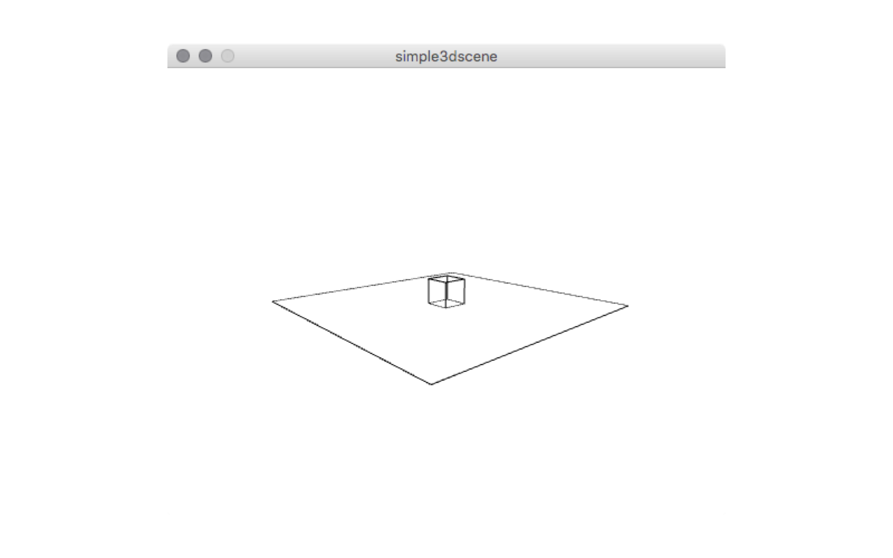

## 3D Application (Processing)  

> Processing (programming language)
> Processing is an open source programming language and integrated development environment (IDE) built for the electronic arts, new media art, and visual design communities with the purpose of teaching the fundamentals of computer programming in a visual context, and to serve as the foundation for electronic sketchbooks. The project was initiated in 2001 by Casey Reas and Benjamin Fry, both formerly of the Aesthetics and Computation Group at the MIT Media Lab. One of the stated aims of Processing is to act as a tool to get non-programmers started with programming through the instant gratification of visual feedback. The language builds on the Java language, but uses a simplified syntax and graphics programming model. In 2012, they started the Processing Foundation along with Daniel Shiffman, who formally joined as a third project lead.
>[From Wikipedia, the free encyclopedia](https://en.wikipedia.org/wiki/Processing_\(programming_language\))

We wont go in depth into programming with Processing. This here are just some notes on how to export usable 3D data for our purpose. For this we have this simple 3D scene that will create a OBJ file you can use in 123DMake and Paperkura. First you need to install the [OBJExport](http://n-e-r-v-o-u-s.com/tools/obj/) library from [Nervous System](http://n-e-r-v-o-u-s.com/index.php). There is a guide on the Processing Wiki on [how to install libraries manually](https://github.com/processing/processing/wiki/How-to-Install-a-Contributed-Library#manual-install). If this worked you can open the Processing IDE, paste the sketch blow into the window and run the sketch. This will create simple scene with a cube and plane and will create the output.obj file next to your Processing sketch. This data can be edited in [Blender](#3d-application-\(blender\))   


/**
 * Simple sketch for doing papercraft
 * uses the OBJExport library from
 * http://n-e-r-v-o-u-s.com/tools/obj/
 *
 * @author Fabian "fabiantheblind" Morón Zirfas
 * @license ISC https://opensource.org/licenses/ISC
 */
import nervoussystem.obj.*; // import the lib

/**
 * the setup runs once.
 * We only set the size of the canvas.
 *
 */
void setup() {
  size(500, 400, P3D);
}
/**
 * This runs all the time. Actually we use the noLoop() statement.
 * it prevents that our scene gets exported each frame.
 *
 */
void draw() {
  background(255);
  // set the position of the camera
  camera(width/10, height/3, -30, width/2, height/2, -250, 0, 1, 0);
  // start the export
  beginRecord("nervoussystem.obj.OBJExport", "output.obj");
  // offset the scene to the center of the canvas.
  // This makes the calculation of the coordiantes easier
  translate(width/2, height/2, -250);
  // make a transformation that only affects the plane
  pushMatrix();
  // rotate by 90 degrees on the x axis
  rotateX(radians(90));
  // start the shape.
  beginShape(QUADS);
  // write the vertices
  vertex(-100, -100, -10);
  vertex(100, -100, -10);
  vertex(100, 100, -10);
  vertex(-100, 100, -10);
  // end the shape
  endShape();
  // reset the matrix of the the sketch so the
  // rotation does not affect the other objects
  popMatrix();
  // we don't want the cube tu be solid
  noFill();
  // start the cube
  beginShape(QUADS);
  vertex(-10, 10, 10);
  vertex( 10, 10, 10);
  vertex( 10, -10, 10);
  vertex(-10, -10, 10);

  vertex( 10, 10, 10);
  vertex( 10, 10, -10);
  vertex( 10, -10, -10);
  vertex( 10, -10, 10);

  vertex( 10, 10, -10);
  vertex(-10, 10, -10);
  vertex(-10, -10, -10);
  vertex( 10, -10, -10);

  vertex(-10, 10, -10);
  vertex(-10, 10, 10);
  vertex(-10, -10, 10);
  vertex(-10, -10, -10);

  vertex(-10, 10, -10);
  vertex( 10, 10, -10);
  vertex( 10, 10, 10);
  vertex(-10, 10, 10);

  vertex(-10, -10, -10);
  vertex( 10, -10, -10);
  vertex( 10, -10, 10);
  vertex(-10, -10, 10);
  // end the cube
  endShape();
  // end the recording
  // this also exports the obj file
  endRecord();
  // we don't want to run the sketch again
  noLoop();
}


  
